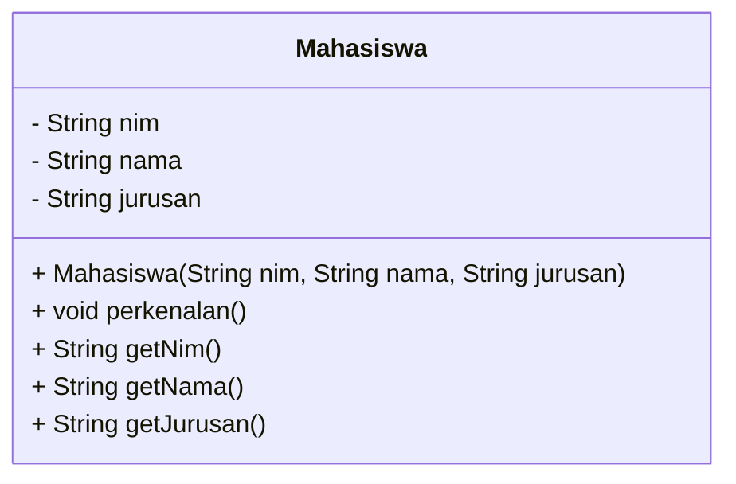

# Ujian OOP

**Mata Kuliah:** Pemograman Berorientasi Objek  
**Nama:** Ammar  
**NIM:** 2024573010129  
**Kelas:** TI2B

## Soal

### 1. Sebuah sistem akademik memiliki data mahasiswa dengan atribut NIM, nama, dan jurusan. tentukan nama class yang tepat berdasarkan atribut dan methodnya!.

**jawab:** 

Nama class yang tepat untuk ini adalah mahasiswa dengan atribut nim, nama, jurusan tipe String dan memiliki method helper seperti getter, constructor, dan juga method konkrit perkenalan().


#### **Seperti contoh Diagram:**


#### **Seperti contoh Program:**
```java
public class Mahasiswa {
    private String nim;
    private String nama;
    private String jurusan;

    public Mahasiswa(String nim, String nama, String jurusan) {
        this.nim = nim;
        this.nama = nama;
        this.jurusan = jurusan;
    }

    public void perkenalan() {
        System.out.println("Halo semuanya, perkenalkan");
        System.out.printf("Nama saya adalah %s %n", getNama());
        System.out.printf("Nim saya adalah %s %n", getNim())
        System.out.printf("dan saya dari jurusan %s%n", getJurusan());
    }

    public String getNim() {
        return nim;
    }

    public String getNama() {
        return nama;
    }

    public String getJurusan() {
        return jurusan;
    }
}
```

### 2. Apa pengalaman paling berkesan ketika belajar pemograman berorientasi objek?.

**jawab:**

Pengalaman saya paling berkesan adalah ketika membuat projek java sederhana yang menerapkan konsep OOP, dari sini saya bisa belajar konsep OOP lebih dalam, terutama pada abstract dan polymorphisme.

### 3. Menurut saudara berapakah nilai yang layak diterima untuk mata kuliah pemograman berorientasi objek, sebutkan alasannya!.

**jawab:**

Menurut saya, nilai yang layak saya terima untuk mata kuliah Pemrograman Berorientasi Objek adalah 85, karena saya sudah memahami konsep dasar OOP dan mampu mengimplementasikannya dalam program yang saya buat, meskipun masih terdapat beberapa kekurangan yang perlu saya pelajari lebih lanjut.